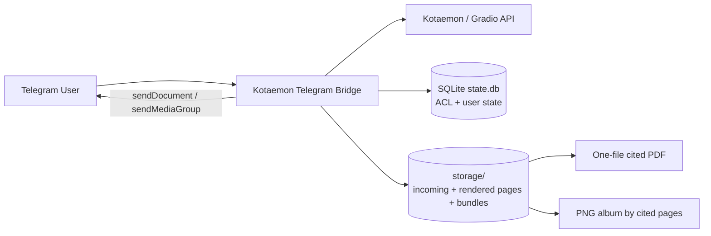

# Kotaemon Telegram Bridge

[](README.md)
[](README_RU.md)

[](https://www.python.org/)
[](https://openai.com)
[](LICENSE)
[](https://github.com/kepan1n/kotaemon-telegram/stargazers)
[](https://github.com/kepan1n/kotaemon-telegram/issues)
[](https://github.com/kepan1n/kotaemon-telegram/commits/main)

Telegram bridge for **Kotaemon** with production-focused UX: document selection, clean citations, cited-page PDF delivery, PNG album, ACL, local storage ingest and systemd deploy.

## What changed recently

- `/start` now opens file picker immediately (no command wall)
- Dedicated `/cmd` help command
- Cited-pages one-file PDF flow (`📄 PDF откуда Инфо`)
- `🧩 PNG album` action (media-group in one message)
- `citsrc` sends quote in **image caption** (single message per image)
- Local storage ingest pipeline (`/ingest`) with persistent page artifacts
- Better Telegram timeout handling, retries, and verbose diagnostics
- Optional HTTP proxy via systemd drop-in

## Architecture (high-level)



## Quickstart

### 1) Local run

```bash
python3 -m venv .venv
source .venv/bin/activate
pip install -r requirements.txt
cp .env.example .env
# edit .env
python bot.py
```

### 2) Server deploy (Ubuntu + systemd)

```bash
chmod +x deploy.sh
./deploy.sh <linux-user>
```

Service logs:

```bash
journalctl -u kotaemon-telegram-bridge -f
```

### 3) First Telegram flow

1. `/start`
2. Select files in `/files`
3. Ask a question (`/ask ...` or plain text)
4. Use inline actions:
   - `📄 PDF откуда Инфо` — one-file cited-pages PDF
   - `🧩 PNG альбом` — cited PNG pages as one album
   - `📎 Цитаты + PDF` — quote + matching page image

## Commands

- `/start` — greeting + immediate file picker
- `/cmd` — full command help
- `/files` — inline file picker
- `/use <name|id>` — select file by name/id
- `/clearuse` — clear selected files
- `/selected` — show selected file ids
- `/ask <question>` — ask Kotaemon
- `/citations` — cleaned citations
- `/sources` — cited-pages PDF sources flow
- `/citsrc` — citation + matching page image
- `/mindmap` — mindmap image
- `/relogin` — relogin to Kotaemon

Admin:
- `/adduser <telegram_id>`
- `/deluser <telegram_id>`
- `/users`
- `/prepdf <pdf_url_or_path>`
- `/prepdfid <file_id>`
- `/ingest [file_id|name|path]`

## Local storage mode (fastest)

Put PDFs into:
- `storage/incoming/<file_id>.pdf` or `storage/incoming/<name>.pdf`

Then run (admin):
- `/ingest <file_id|name|path>` for one file
- `/ingest` to process all PDFs in `storage/incoming`

Generated artifacts:
- `storage/rendered/pdf_pages/<key>/page-XXXX.pdf`
- `storage/rendered/png_pages/<key>/page-XXXX.png`
- `storage/rendered/bundles/<key>.pdf`

How it works:
- bot resolves selected `file_id` against local index
- extracts cited pages
- builds one compact PDF from cited pages (up to 10)
- sends one file (with background retry fallback)

## Proxy (optional, systemd drop-in)

`/etc/systemd/system/kotaemon-telegram-bridge.service.d/proxy.conf`

```ini
[Service]
Environment="HTTP_PROXY=http://127.0.0.1:7080"
Environment="HTTPS_PROXY=http://127.0.0.1:7080"
Environment="NO_PROXY=localhost,127.0.0.1,1chat.legenda-group.ru,.legenda-group.ru"
```

Apply:

```bash
sudo systemctl daemon-reload
sudo systemctl restart kotaemon-telegram-bridge
sudo systemctl show kotaemon-telegram-bridge --property=Environment --no-pager
```

## Security

- Keep `.env` private
- Use strict whitelist
- Prefer dedicated Kotaemon account instead of `admin`

## License

Apache-2.0
