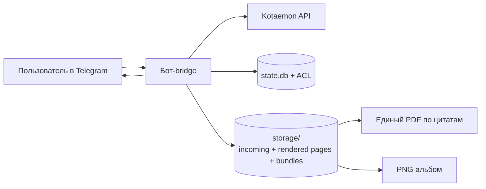

# Kotaemon Telegram Bridge

[](README.md)
[](README_RU.md)

Telegram-bridge для **Kotaemon** с удобным Telegram UX: выбор документов, чистые цитаты, единый PDF по цитируемым страницам, PNG-альбом, ACL, локальный ingest и systemd-деплой.

## Что добавлено/улучшено

- `/start` сразу показывает выбор файлов
- Справка вынесена в `/cmd`
- `📄 PDF откуда Инфо` — единый PDF по страницам цитат
- `🧩 PNG альбом` — все PNG-страницы одним media-group сообщением
- `📎 Цитаты + PDF` — цитата подписью к изображению
- Локальный ingest (`/ingest`) и персистентное хранилище страниц
- Улучшены retry/timeout и диагностические логи
- Опциональная работа через HTTP proxy (systemd drop-in)

## Диаграмма (упрощённо)



## Quickstart

### 1) Локальный запуск

```bash
python3 -m venv .venv
source .venv/bin/activate
pip install -r requirements.txt
cp .env.example .env
# заполните .env
python bot.py
```

### 2) Деплой на Ubuntu Server

```bash
chmod +x deploy.sh
./deploy.sh <linux-user>
```

Логи:

```bash
journalctl -u kotaemon-telegram-bridge -f
```

### 3) Базовый сценарий в Telegram

1. `/start`
2. Выбрать документы (`/files`)
3. Задать вопрос (`/ask ...` или обычный текст)
4. Использовать inline-кнопки:
   - `📄 PDF откуда Инфо`
   - `🧩 PNG альбом`
   - `📎 Цитаты + PDF`

## Команды

- `/start` — приветствие + выбор файлов
- `/cmd` — список команд
- `/files` — inline-пикер файлов
- `/use <name|id>` — выбрать файл
- `/clearuse` — очистить выбор
- `/selected` — показать выбранные file_id
- `/ask <question>` — вопрос в Kotaemon
- `/citations` — очищенные цитаты
- `/sources` — поток источников (PDF по цитатам)
- `/citsrc` — цитата + соответствующая страница
- `/mindmap` — mindmap
- `/relogin` — relogin в Kotaemon

Админ:
- `/adduser <telegram_id>`
- `/deluser <telegram_id>`
- `/users`
- `/prepdf <pdf_url_or_path>`
- `/prepdfid <file_id>`
- `/ingest [file_id|name|path]`

## Локальное хранилище (самый быстрый режим)

Клади PDF в:
- `storage/incoming/<file_id>.pdf` или `storage/incoming/<name>.pdf`

Команды:
- `/ingest <file_id|name|path>` — обработать один PDF
- `/ingest` — обработать все PDF из `storage/incoming`

Артефакты:
- `storage/rendered/pdf_pages/<key>/page-XXXX.pdf`
- `storage/rendered/png_pages/<key>/page-XXXX.png`
- `storage/rendered/bundles/<key>.pdf`

Как работает:
- бот сопоставляет выбранный `file_id` с локальным индексом,
- находит страницы цитат,
- собирает единый компактный PDF (до 10 страниц),
- отправляет одним файлом.

## Прокси (опционально, systemd drop-in)

`/etc/systemd/system/kotaemon-telegram-bridge.service.d/proxy.conf`

```ini
[Service]
Environment="HTTP_PROXY=http://127.0.0.1:7080"
Environment="HTTPS_PROXY=http://127.0.0.1:7080"
Environment="NO_PROXY=localhost,127.0.0.1,kotaemon.example.com,.example.com"
```

Применить:

```bash
sudo systemctl daemon-reload
sudo systemctl restart kotaemon-telegram-bridge
sudo systemctl show kotaemon-telegram-bridge --property=Environment --no-pager
```

## Безопасность

- Не храните секреты в git
- Держите whitelist строгим
- Лучше использовать отдельного пользователя Kotaemon
